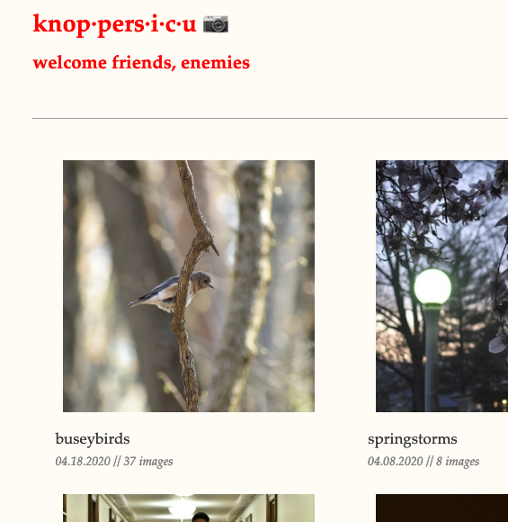
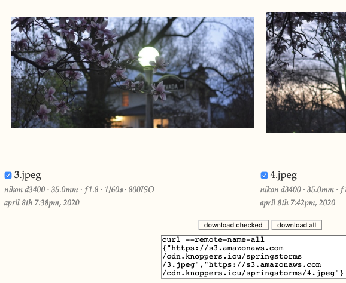
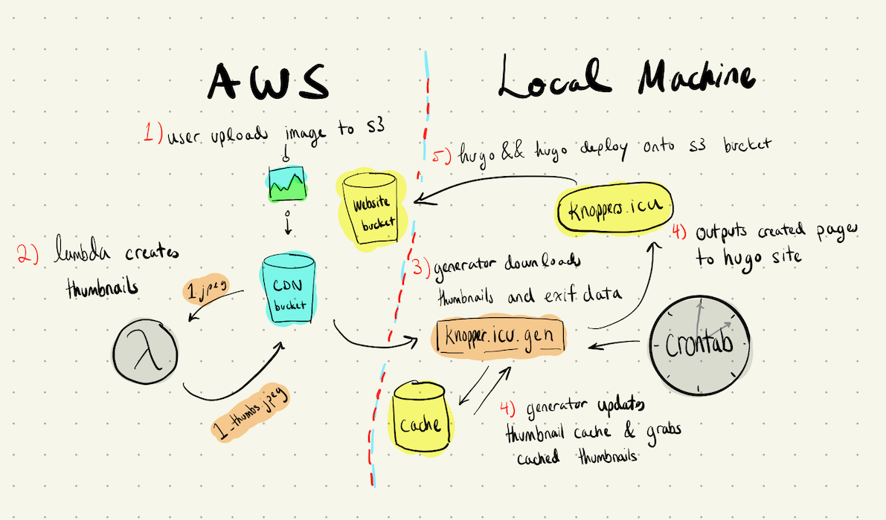
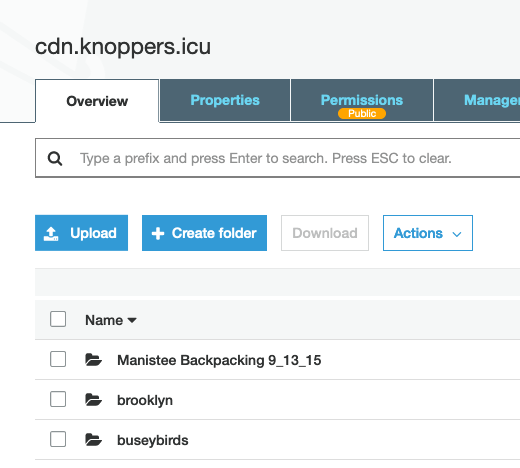

# [knoppers.icu](www.knoppers.icu) 📷

A programmatically generated photography archive powered by [knoppers.icu.gen](https://github.com/slin63/s3-page-generator).

Read about it here: [chronicpizza.net/posts/knoppersicu](https://www.chronicpizza.net/posts/knoppersicu/).

##### Goal:

To create a responsive and fast web service for previewing and downloading high-res JPEGs of my photography.

##### Why:

Google Photos charges extra if you want to upload original, uncompressed JPEGs. So does AWS, eventually, but I don't mind because I'm having a little fun with it.

Google Photos also can't be used as a janky image host for my website, www.chronicpizza.net, meaning that I have to redownload, resize, and in general fumble around with photos for *another* time before I can use them.

##### Solution:

A Hugo site whose posts are generated by a Python script scraping an s3 bucket and doubles as an image host for my blog.

##### Result:

- Stupid-fast loading of massive photo galleries (100+ images) thanks to a thumbnail preprocessing Lambda
- Zero maintenance website with split-second deploys easily handled by a single cronjob
- Able to have my photos accessible to normal people (and myself) online by *just* uploading to s3, and not another website.

### Screenshots:

- *homepage*

- *portion of gallery view and download box*

##### Inner Machinations:

- *infrastructure overview*

- *screenshot of s3 bucket structure*

